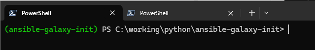
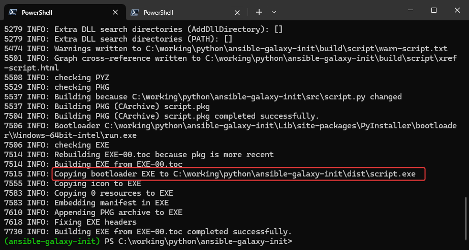

```powershell
python -m venv ansible-galaxy-init
ansible-galaxy-init\Scripts\Activate
.\Scripts\python.exe -m pip install --upgrade pyinstaller jinja2
```



```powershell
pyinstaller --add-data ".\src\templates:templates" --onefile .\src\script.py
```



